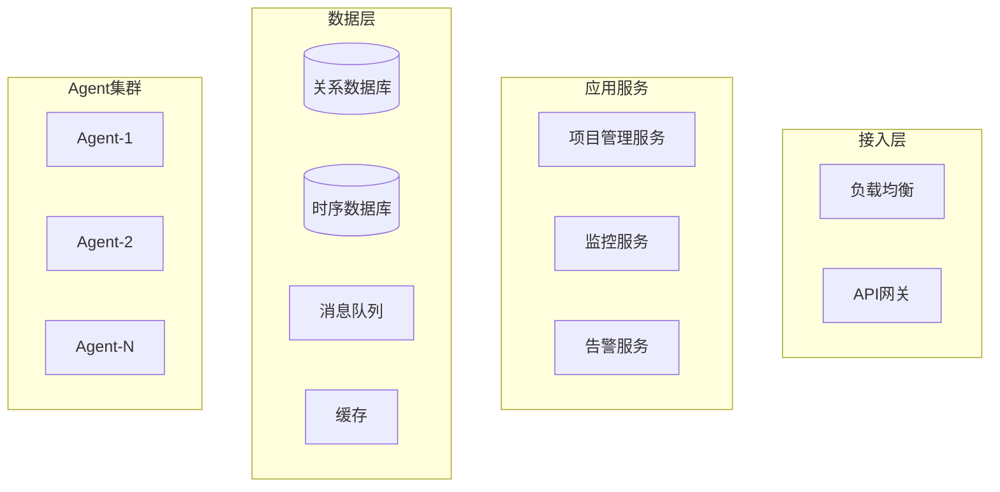
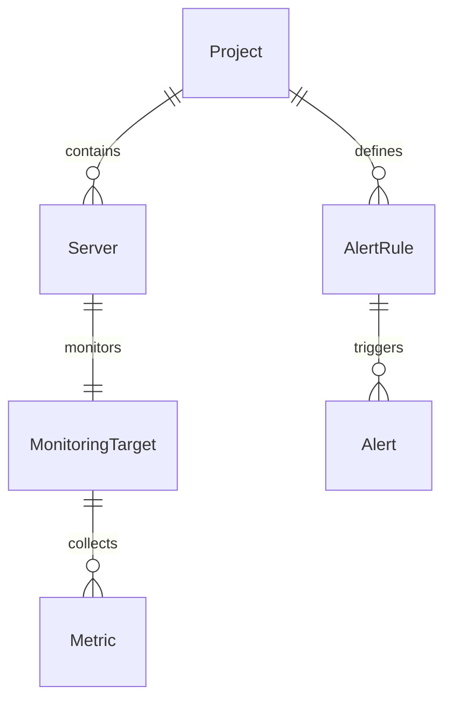

# 系统设计文档

## 一、系统定位

### 1. 业务价值
- 集中化管理项目服务器资源
- 实时掌握服务器运行状态
- 快速发现和响应系统异常
- 降低运维管理成本

### 2. 系统边界
- 项目维度的资源管理
- 服务器状态监控
- 异常告警和处理
- 不包含:代码部署、配置管理

## 二、核心功能

### 1. 用户管理中心
1. 用户组织
   - 组织架构管理
   - 用户角色分配
   - 资源访问控制

2. 权限管理
   - 基于角色的权限控制
   - 数据访问权限
   - 操作权限管理

### 2. 项目管理中心
1. 项目生命周期
   - 项目创建与配置
   - 项目状态管理
   - 项目资源限制
   - 项目成员管理

2. 服务器资源管理
   - 服务器注册与分组
   - 服务器状态监控
   - 资源使用分析
   - 性能指标趋势

3. 监控指标管理
   - 系统基础指标
     * CPU使用率
     * 内存使用率
     * 磁盘使用率
     * 网络吞吐量
   - 应用层指标
     * 进程状态
     * 端口监听
     * 服务响应时间
   - 业务层指标
     * 请求QPS
     * 错误率
     * 业务延迟

### 3. 监控告警中心
1. 告警规则管理
   - 指标阈值规则
   - 多条件组合规则
   - 时间窗口规则
   - 告警级别定义

2. 告警处理流程
   - 告警检测
   - 告警确认
   - 告警升级
   - 告警关闭

3. 通知分发管理
   - 通知渠道配置
   - 通知模板管理
   - 通知组管理
   - 通知策略控制

### 4. 运维管理中心
1. Agent管理
   - Agent部署
   - 配置管理
   - 状态监控
   - 版本更新

2. 日志管理
   - 日志采集
   - 日志分析
   - 日志检索
   - 日志存储

3. 运维工具
   - 批量操作
   - 统计报表
   - 故障诊断
   - 性能分析

## 三、技术架构

### 1. 系统分层
```
应用层 (Application)
├── 项目管理中心
├── 监控告警中心
└── 运维管理中心

领域层 (Domain)
├── 项目领域
│   ├── 项目聚合
│   └── 服务器实体
├── 监控领域
│   ├── 监控目标
│   └── 监控指标
└── 告警领域
    ├── 告警规则
    └── 告警事件

基础设施层 (Infrastructure)
├── 数据存储
│   ├── 关系型数据库
│   └── 时序数据库
├── 消息队列
│   ├── 数据采集队列
│   └── 告警通知队列
└── 缓存服务
```

### 2. 部署架构


## 四、关键设计

### 1. 数据模型


### 2. 核心流程
1. 服务器接入流程
2. 数据采集流程
3. 告警处理流程
4. 运维操作流程

### 3. 扩展机制
1. 插件化监控指标
2. 自定义告警规则
3. 灵活通知方式

## 五、安全设计

### 1. 访问控制
- 基于角色的权限控制
- 多租户数据隔离
- API访问认证

### 2. 数据安全
- 敏感数据加密
- 传输层安全
- 审计日志 

# 系统架构设计

## 1. 整体架构

### 1.1 多租户架构
- 共享数据库，独立Schema
- 租户级资源配额
- 多级权限控制
- 数据完全隔离

### 1.2 领域模型
```
+---------------+     +---------------+     +---------------+
| Tenant        |     | Project       |     | Server        |
|---------------|     |---------------|     |---------------|
| - id          |     | - id          |     | - id          |
| - name        |     | - tenant_id   |     | - name        |
| - status      |     | - name        |     | - host        |
| - quota       |     | - status      |     | - status      |
|---------------|     |---------------|     |---------------|
| + addProject  |     | + addServer   |     | + updateMetrics|
+---------------+     +---------------+     +---------------+
``` 